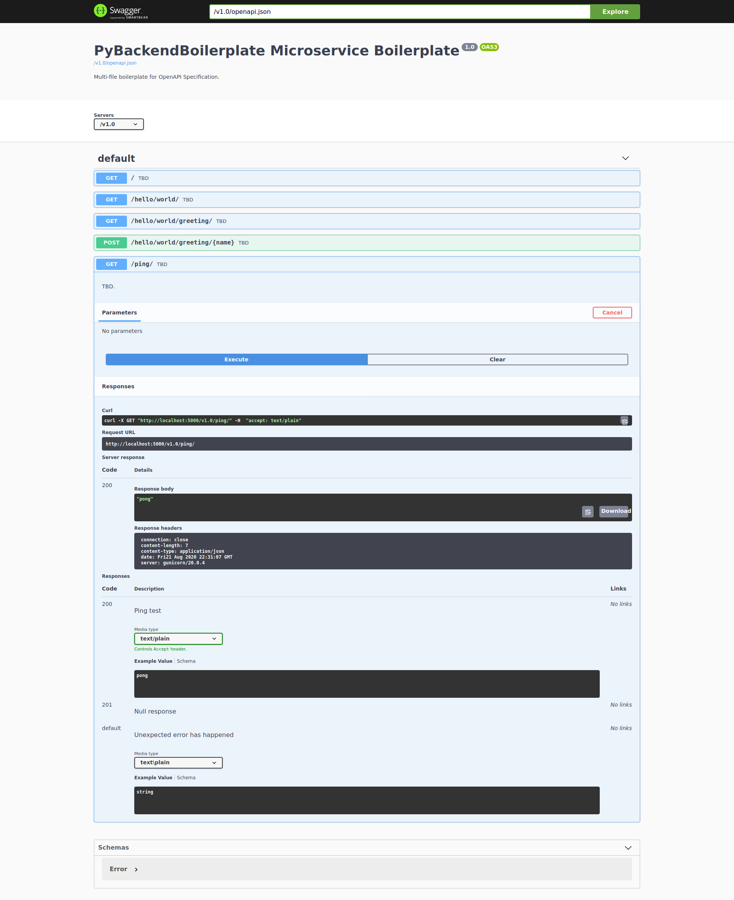

# PyBackendBoilerplate Micro-Service Boilerplate.

## Development status: WIP

This is a [template github repository](https://docs.github.com/en/github/creating-cloning-and-archiving-repositories/creating-a-repository-from-a-template) for a microservice that is based on [Flask](https://flask.palletsprojects.com/) and [OpenAPI 3](https://swagger.io/specification/) using [Connexion](https://github.com/zalando/connexion).

The infrastructure is based on the [SDK package](https://github.com/PyBackendBoilerplate/sdk) for all common features and is based on [this](https://github.com/PyBackendBoilerplate/sdk#tech-stack) stack.

## How do I use this

Basically what you need to do is create your own copy of this repository (can use the [GitHub Template Repository](https://docs.github.com/en/github/creating-cloning-and-archiving-repositories/creating-a-repository-from-a-template) feature) and you can start working.

### Project source structure

```
src -> Root folder for the source code
│   app.py -> Module containing the WSGI (app)
│   main.py -> Main file for running as local python script
|   sdk -> Soft link to ../../sdk/src/sdk
│
└───api -> All routes RESTful APIs implementation
│   │   root.py -> Implements the root path's RESTful API
│   │   ... more routes's implementations
│   │
│   └───sdk -> Soft link to ../../sdk/src/sdk/api
│
└───config -> The micro-service specific's configurations
│   │   gunicorn_conf.py -> Gunicorn's config
│
└───openapi -> Root folder for the OpenAPI specification YAML files
    │   openapi.yaml -> Main (root) OpenAPI specification YAML file
```

This gives you a basic file structure with a working mechanism for running an app in a microservice.
From here on you need to rename some of the places with your own microservice name and add your own APIs and that's it, everything else is already set.

Feel free to remove the example [APIs](./src/openapi/openapi.yaml#L10) and change them with your own.

## How do I run this

The package uses a [Makefile](./Makefile) for easy CLI but there are also the common methods.

1) So first clone this repository.
2) Run `git submodule update --init --recursive` inside the repository (to get the sdk's code).
3) Run `make install` in the root repository directory.
4) Try it out using one of the available running options:s

    * Run `run_locally.sh` to run locally as a script (with auto-create a .venv and use that) - does not requires `make install` prior to running this way.
    * `make gunicorn` to run with Gunicorn (in the docker container).
    * `make gunicorndebug` to run with Gunicorn with container debugging enabled (VS Code only).
    * `make flask` to run with the standard Flask CLI (in the docker container).
    * `make flaskdebug` to run with the standard Flask CLI with container debugging enabled (VS Code only).
    * `docker-compose up` to run with docker-compose (see [Dockerfile](./Dockerfile#L33) for entry point definition)
    * `docker run micro-service_service_name` to run with docker (see [Dockerfile](./Dockerfile#L33) for entry point definition)

Afterwards, you can see it running in your browser:
- http://0.0.0.0:5000/v1.0/ -> Will be handled by the [root()](./src/api/root.py#L15) function.
- http://localhost:5000/v1.0/ui/#/ -> Automatically generated Swagger UI.

For example, running and using the http://0.0.0.0:5000/v1.0/ping REST API from the Swagger UI (using Gunicorn):



### Running in docker container with Flask

```
myuser@ [~/dev/pyBackendBoilerplate] [Git Branch: master] :
$ git clone https://github.com/PyBackendBoilerplate/micro-service.git
Cloning into 'micro-service'...
remote: Enumerating objects: 61, done.
remote: Counting objects: 100% (61/61), done.
remote: Compressing objects: 100% (40/40), done.
remote: Total 61 (delta 6), reused 61 (delta 6), pack-reused 0
Receiving objects: 100% (61/61), 123.81 KiB | 220.00 KiB/s, done.
Resolving deltas: 100% (6/6), done.

myuser@ [~/dev/pyBackendBoilerplate] [Git Branch: master] :
$ cd micro-service/

myuser@ [~/dev/pyBackendBoilerplate/micro-service] [Git Branch: master] :
$ git submodule update --init --recursive
Submodule 'sdk' (git@github.com:PyBackendBoilerplate/sdk.git) registered for path 'sdk'
Cloning into '/home/nusnus/dev/PyBackendBoilerplate/ttt/micro-service/sdk'...
Submodule path 'sdk': checked out '9aa954b8a8ff47bd1ecd3f6b6506cfbf3f95f348'

myuser@ [~/dev/pyBackendBoilerplate/micro-service] [Git Branch: master] :
$ make install 
docker-compose build
Building service_name
Step 1/15 : FROM python:3.8
 ---> 7f5b6ccd03e9
...
Step 15/15 : CMD ["gunicorn", "--config", "src/config/gunicorn_conf.py", "src.app:app"]
 ---> Running in f6840528b530
Removing intermediate container f6840528b530
 ---> 504a6fe9312a

Successfully built 504a6fe9312a
Successfully tagged micro-service_service_name:latest

myuser@ [~/dev/pyBackendBoilerplate/micro-service] [Git Branch: master] :
$ make flask
docker-compose run --rm -e VSCODE_DEBUG_MODE=False --service-ports service_name flask run
 * Serving Flask app "src.app:app"
 * Environment: DEVELOPMENT
 * Debug mode: off
 * Running on http://127.0.0.1:5000/ (Press CTRL+C to quit)
```

Entering into: http://0.0.0.0:5000/v1.0/
```
127.0.0.1 - - [21/Aug/2020 21:22:58] "GET /v1.0/ HTTP/1.1" 200 -
```

Entering into: http://localhost:5000/v1.0/ui/#/
```
127.0.0.1 - - [21/Aug/2020 21:23:21] "GET /v1.0/ui/ HTTP/1.1" 200 -
127.0.0.1 - - [21/Aug/2020 21:23:21] "GET /v1.0/openapi.json HTTP/1.1" 200 -
```

Running the http://0.0.0.0:5000/v1.0/ping API using the Swagger UI:
```
127.0.0.1 - - [21/Aug/2020 21:23:31] "GET /v1.0/ping/ HTTP/1.1" 200 -
```

### Running in docker container with Gunicorn

```
$ make gunicorn
docker-compose run --rm -e VSCODE_DEBUG_MODE=False --service-ports service_name gunicorn --config "src/config/gunicorn_conf.py" "src.app:app"
[2020-08-21 21:30:37 +0000] [1] [INFO] Starting gunicorn 20.0.4
[2020-08-21 21:30:37 +0000] [1] [INFO] Listening at: http://0.0.0.0:5000 (1)
[2020-08-21 21:30:37 +0000] [1] [INFO] Using worker: sync
[2020-08-21 21:30:37 +0000] [1] [INFO] Server is ready. Spawning workers
[2020-08-21 21:30:37 +0000] [7] [INFO] Booting worker with pid: 7
[2020-08-21 21:30:37 +0000] [7] [INFO] Worker spawned (pid: 7)
```

Both URLs are working the same:
- http://0.0.0.0:5000/v1.0/
- http://localhost:5000/v1.0/ui/#/

And after hitting Ctrl+C in the terminal:

```
^C[2020-08-21 21:32:17 +0000] [7] [INFO] worker received INT or QUIT signal
[2020-08-21 21:32:17 +0000] [1] [INFO] Handling signal: int
[2020-08-21 21:32:17 +0000] [7] [INFO] worker received INT or QUIT signal
[2020-08-21 21:32:17 +0000] [7] [INFO] Worker exiting (pid: 7)
[2020-08-21 21:32:17 +0000] [1] [INFO] Shutting down: Master
```

### Running locally as a python script

```
myuser@ [~/dev/pyBackendBoilerplate/micro-service] [Git Branch: master] :
$ ./run_locally.sh                                                                                                                
Installing virtual environment in .venv
Active Environment: DEVELOPMENT
Installing pip requirements files in the virtual environment: .venv

Collecting pip
  Using cached pip-20.2.2-py2.py3-none-any.whl (1.5 MB)
Installing collected packages: pip
  Attempting uninstall: pip
    Found existing installation: pip 20.0.2
    Uninstalling pip-20.0.2:
      Successfully uninstalled pip-20.0.2
Successfully installed pip-20.2.2
Collecting Flask
  Using cached Flask-1.1.2-py2.py3-none-any.whl (94 kB)
Collecting gunicorn
  Using cached gunicorn-20.0.4-py2.py3-none-any.whl (77 kB)
...

Finished installing pip requirements files in the virtual environment: .venv
 * Serving Flask app "service_name" (lazy loading)
 * Environment: DEVELOPMENT
 * Debug mode: off
 * Running on http://0.0.0.0:5000/ (Press CTRL+C to quit)
```

Both URLs are working the same:
- http://0.0.0.0:5000/v1.0/
- http://localhost:5000/v1.0/ui/#/

```
127.0.0.1 - - [22/Aug/2020 00:58:30] "GET /v1.0/ HTTP/1.1" 200 -
127.0.0.1 - - [22/Aug/2020 00:58:45] "GET /v1.0/ui/ HTTP/1.1" 200 -
127.0.0.1 - - [22/Aug/2020 00:58:45] "GET /v1.0/ui/swagger-ui.css HTTP/1.1" 200 -
127.0.0.1 - - [22/Aug/2020 00:58:45] "GET /v1.0/openapi.json HTTP/1.1" 200 -
127.0.0.1 - - [22/Aug/2020 00:58:52] "GET /v1.0/ping/ HTTP/1.1" 200 -
```

### Running in using docker-container up (per defined in the Dockerfile)

```
myuser@ [~/dev/pyBackendBoilerplate/micro-service] [Git Branch: master] :
$ docker-compose up
Recreating micro-service_service_name_1 ... done
Attaching to micro-service_service_name_1
service_name_1  | [2020-08-21 22:09:07 +0000] [1] [INFO] Starting gunicorn 20.0.4
service_name_1  | [2020-08-21 22:09:07 +0000] [1] [INFO] Listening at: http://0.0.0.0:5000 (1)
service_name_1  | [2020-08-21 22:09:07 +0000] [1] [INFO] Using worker: sync
service_name_1  | [2020-08-21 22:09:07 +0000] [1] [INFO] Server is ready. Spawning workers
service_name_1  | [2020-08-21 22:09:07 +0000] [7] [INFO] Booting worker with pid: 7
service_name_1  | [2020-08-21 22:09:07 +0000] [7] [INFO] Worker spawned (pid: 7)
```

Both URLs are working the same:
- http://0.0.0.0:5000/v1.0/
- http://localhost:5000/v1.0/ui/#/

And after hitting Ctrl+C in the terminal:

```
^CGracefully stopping... (press Ctrl+C again to force)
Stopping micro-service_service_name_1   ... done
```

## Debugging options (VS Code only)

Run locally via with the `Python: Gunicorn` VS Code launch configuration.

To run as a docker container and debug remotely, use the `Python: Docker (Remote Attach)` VS Code launch configuration. To be used when running with `make gunicorndebug` or `make flaskdebug`.

For example (Running from the base dir of the Makefile):
- Step 0) Set the `Python: Docker (Remote Attach)` as your selected launch config.
- Step 1) Run `make gunicorndebug` in the VS Code terminal.
- Step 2) Wait for the debugger attaching instructions in stdout.
- Step 3) Set some breakpoints and that's it, you're debugging the container running the Flask app.

For addition help on this subject, see [Flask Debugging in VS Code with Hot-Reload 🔥](https://blog.theodo.com/2020/05/debug-flask-vscode/).

## Development

For additional development info, please see the [SDK's instructions and information](https://github.com/PyBackendBoilerplate/sdk#development).